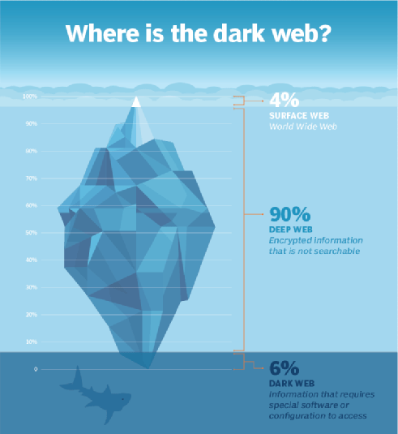

banner:: https://www.bleepstatic.com/content/hl-images/2020/08/19/Tor-headpic.jpg
banner-height:: 350px
icon::  🧅

- # What is the dark web?
- ### The Origins
	- Contrary to popular belief, the technologies made for the dark web wasn't originally made for criminal activities. Developed by the US Naval Research Laboratory, the aim was to protect the communications of intelligence agencies. This focus on untraceable online activity was the starting-point for the tools that both enable and shield users on the dark web today. The reason dark web is called `dark web` is because its pretty much like a room with no lights! If you go inside one, you can't be seen by anyone and you also can't see anyone other than the thing/person you were looking for.
- ### The Iceberg
	- {:height 543, :width 491}
	- This is a visual representation of what the internet looks like. The surface web aka the clearnet is what we can find easily using things like google, only 4% of the internet is on the surface web. The deep web is all the things that can't be found easily, but aren't necessarily a part of the darknet; On this level lie the netbanking sites, private data, medical records, etc. 90% of the internet is on the deep web. The dark web aka the darknet consists all the information that can't be accessed with normal tools, only special tools like the TOR browser can be used to access this level. Only 4% of the internet is on the dark web.
- ### Tools of the Trade:
	- **TOR (The Onion Router):** This free software is the key to accessing the dark web. It bounces your internet traffic through a maze-like network of servers (called nodes) around the world, making it extremely difficult to pinpoint your actual location or activity.
	  logseq.order-list-type:: number
	  [[TOR Network]]
	- **.onion Addresses:** These specialized domains are like hidden doorways to dark web websites. Unlike regular websites, they require the TOR browser to be accessed.
	  logseq.order-list-type:: number
	- **Onion Routing:** Think of it like your data wrapped in layers of encryption. Similar to how ogres are like onions, the dark web is also like an onion, they all have layers. Each TOR node peels away a layer, only knowing where to send it next. No single node knows both where the traffic came from and where it's going. This makes tracking you near impossible.
	  logseq.order-list-type:: number
	  {:height 726, :width 318}
	- **The CIA's Onion Link:** The CIA's presence on the dark web [http://ciadotgov4sjwlzihbbgxnqg3xiyrg7so2r2o3lt5wz5ypk4sxyjstad.onion] is a great example. It provides a way for people to submit tips or information securely, even in countries where contacting the agency openly would be dangerous.
	  logseq.order-list-type:: number
- ### Safety Precautions:
	- **TOR Browser:** Always download the TOR browser from the official source for maximum security and anonymity. Using Brave browser for onion sites is not recommended!
	  logseq.order-list-type:: number
	- **Specialized Operating Systems:** Whonix and TailsOS are Linux-based operating systems that route all your internet traffic through the TOR network, plugging potential leaks in your online privacy.
	  logseq.order-list-type:: number
	- **The VPN Conundrum:** While VPNs enhance online privacy, they offer a false sense of security on the dark web. Legal authorities can often compel VPN providers to hand over user data, compromising your anonymity.
	  logseq.order-list-type:: number
- ### The Duality of the Dark Web:
	- The cloak of anonymity that the dark web provides is a tool that can be wielded for both good and evil:
		- **Safe Place for Criticism:** In countries with repressive rulers, the dark web offers a lifeline for journalists, activists, and citizens seeking to share information and organize without fear of reprisal.
		  logseq.order-list-type:: number
		- **Criminal Activities:** The dark web's notoriety stems from the birth of illegal marketplaces. Drugs, stolen data, counterfeit goods, weapons, and other illicit services flourish in an environment where identities are concealed and law enforcement is challenged.
		  logseq.order-list-type:: number
- #### Legitimate Uses for the Dark Web:
	- **Whistleblowers and Journalists:** People like Edward Snowden and the team behind WikiLeaks rely on the dark web's anonymity to safely communicate with sources and share sensitive information. Organizations like ProPublica use it to offer secure ways for people to expose wrongdoing.
	  logseq.order-list-type:: number
	- **Circumventing Censorship:** In countries with oppressive internet controls, the dark web allows citizens to access blocked news websites, organize protests, or report on human rights abuses.
	  logseq.order-list-type:: number
	- **Personal Privacy:** Individuals concerned about excessive government surveillance or corporate data collection may use the dark web to browse, communicate, and engage in online activities with less tracking.
	  logseq.order-list-type:: number
- #### The Appeal for Illegal Activities:
	- **Anonymity:** The difficulty in tracing users of the dark web makes it an attractive environment for those engaging in illicit activities.
	  logseq.order-list-type:: number
	- **Lack of Centralized Control:** There's no single authority enforcing rules or regulations on the dark web. This lawless space enables criminal enterprises to operate more freely.
	  logseq.order-list-type:: number
- #### ^^Navigating the Darknet Markets:^^
	- The potential risks for anyone venturing into a darknet market must not be underestimated:
		- **Danger of Fraud:** Payment scams and sudden market disappearances are common, leaving buyers at a great loss.
		  logseq.order-list-type:: number
		- **Law Enforcement Traps:** Honeypot sites, disguised as genuine markets, are used to identify and punish those involved in illegal activities.
		  logseq.order-list-type:: number
- #### Inside Darknet Markets:
	- **Drugs:** The sale of illegal drugs of all kinds remains a major driver of darknet market activity.
	  logseq.order-list-type:: number
	- **Stolen Data:** Credit card information, personal identities, and hacked login credentials are widely traded.
	  logseq.order-list-type:: number
	- **Counterfeit Goods:** From fake luxury items to fraudulent documents, a thriving market in replicas exists.
	  logseq.order-list-type:: number
	- **Cybercrime Tools:** Malware, hacking software, and even "crime-as-a-service" offerings are disturbingly common.
	  logseq.order-list-type:: number
- ### Untraceable Currency & Market Dynamics:
	- **Monero:** The rise of this privacy-centric cryptocurrency has been fueled by its use on the dark web. Transactions are designed to be nearly impossible to trace.
	  logseq.order-list-type:: number
		- **Untraceable Transactions:** Monero's technology offers a higher level of privacy than Bitcoin. It obscures the sender, receiver, and the amount transacted.
		  logseq.order-list-type:: number
		- **Preferred Payment:** Due to this focus on anonymity, Monero has become the most popular cryptocurrency for the dark web markets.
		  logseq.order-list-type:: number
	- **Black Market Economy:** While accurate figures are elusive, the volume of money flowing through darknet markets is estimated to reach into the billions of dollars annually. The trade in illegal substances remains a major component of this underground economy.
	  logseq.order-list-type:: number
- ### The Risk Equation
	- Exploring the dark web inherently involves heightened security risks. The freedom from surveillance that makes it a haven for persecuted individuals also makes it attractive to criminals. It's paramount to be constantly vigilant to protect yourself from scams, malware, and potential traps laid by law enforcement.
- ### How to access the dark web?
	- Download the TOR Browser on your device through the [torproject.org](https://torproject.org) site.
	  logseq.order-list-type:: number
	- Open the browser and connect to the TOR Network.
	  logseq.order-list-type:: number
	- Get the onion link that you want to access. This can be done in multiple ways but for this example we can use the official TOR site.
	  logseq.order-list-type:: number
	- Make sure your safety is set to `safest`.
	  logseq.order-list-type:: number
	- Access the onion link and you are done!
	  logseq.order-list-type:: number
- ### Further reading
	- A friend of mine has done some research on the dark web and has published his works [online](https://sooox.cc/static/logseq/index.html#/page/the%20onion%20router%20unveiled)! His research is also helped me make this workshop. You can find him at [sooox.cc](https://sooox.cc/) or on his [GitHub](https://github.com/sooox-cc).
- ### Thanks
	- A big thanks to the teachers for allowing me to teach everyone about the dark web, thanks to my friend Sooox for letting me use some of his research (and his college notes XD) for making this presentation, and thank you for being here!
- ### References
  [TOR Project](https://www.torproject.org/)
  [Pro Publica](https://www.propublica.org/)
  [Monero](https://www.getmonero.org/)
  [Whonix](https://www.whonix.org/)
  [TailsOS](https://tails.net/)
  [WikiLeaks](https://wikileaks.org/)